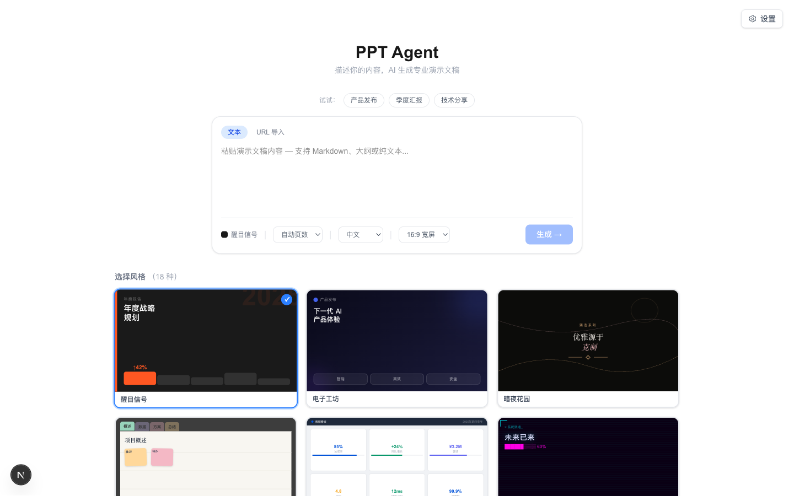
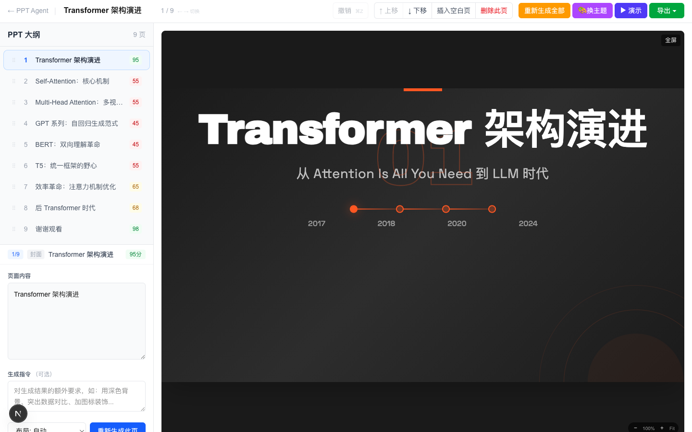
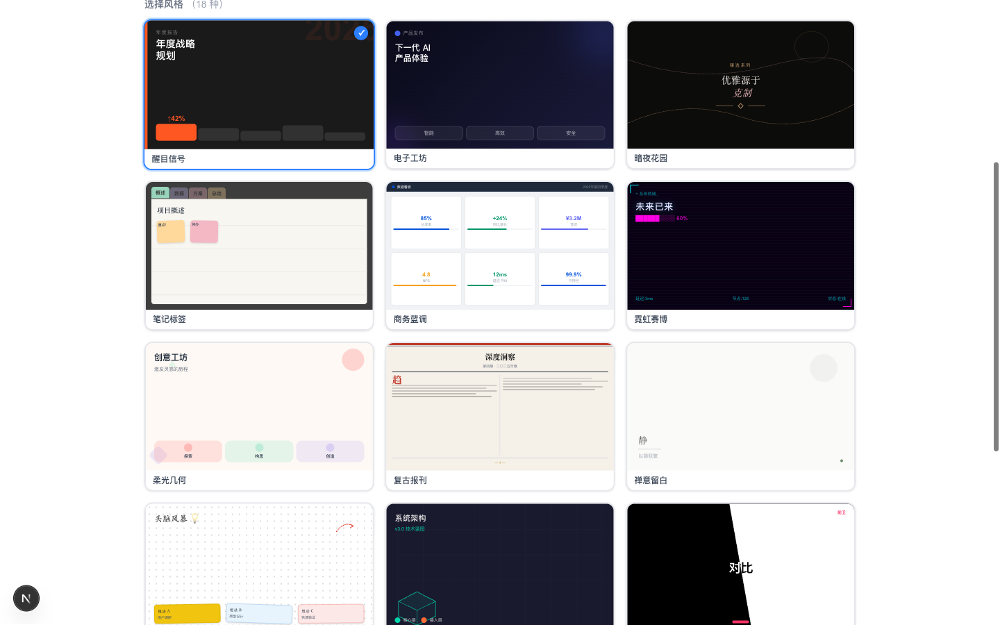

# PPT Agent

> Text in, slides out.

[English](README.md) | [中文](README.zh-CN.md)

**输入任意文本或 URL，30 秒生成专业动画演示文稿。**

一款开源 AI 演示文稿生成器 —— 无需注册、无水印、无供应商锁定。支持私有部署，使用你自己的 API Key。输出为单一 HTML 文件，随处可用。

<p align="center">
  
</p>

<p align="center">
  
</p>

## 为什么选择 PPT Agent？

| | PPT Agent | Gamma.app | Beautiful.ai | Google Slides + AI |
|---|---|---|---|---|
| 私有部署 | ✅ | ❌ | ❌ | ❌ |
| URL → 幻灯片 | ✅ | ❌ | ❌ | ❌ |
| 无需注册 | ✅ | ❌ | ❌ | ❌ |
| 单文件导出 | ✅ | ❌ | ❌ | ❌ |
| 主题切换（免费） | ✅ | 付费 | 付费 | 有限 |
| 开源 | MIT | 闭源 | 闭源 | 闭源 |

## 功能特性

### 输入 — 零门槛
- **粘贴 URL** — 博客文章、文档页面、新闻 → 自动生成幻灯片
- **粘贴文本** — 支持 Markdown、大纲、纯文本
- **3 个示例模板** — 一键体验

### 生成 — 懂设计的 AI
- **18 款精选主题** — 手工打磨的风格预设，不是随机 AI 美学
- **质量自动重试** — 不达标的幻灯片自动重新生成
- **智能布局** — 连续页面自动使用不同布局
- **流式生成** — 实时观看你的演示文稿逐页呈现

### 编辑器 — 直观可视化
- **大纲导航** — 左侧大纲列表，一目了然
- **拖拽排序** — 直接拖动幻灯片调整顺序
- **逐页重新生成** — 不满意某页？用自定义指令重新生成
- **快速换主题** — 一键切换全部幻灯片到新主题
- **撤销支持** — 每一步编辑都可撤销

### 演示 — 开箱即用
- **演示模式** — 演讲者备注、计时器、当前/下一页预览
- **电影级动画** — 元素淡入滑入，交错时序
- **网格概览** — 在导出的 HTML 中按 `G` 查看全部幻灯片
- **键盘导航** — 方向键翻页、全屏、Escape 退出

### 导出 — 你的幻灯片，你做主
- **单一 HTML 文件** — 所有 CSS/JS 内联，零依赖，离线可用
- **智能文件名** — 导出文件使用你的演示标题命名
- **PDF 导出** — 一键生成 PDF
- **无锁定** — 就是 HTML，自由托管、发送、编辑、嵌入

### 生产就绪
- **速率限制** — 每 IP 每分钟 10 次请求，适用于共享部署
- **健康检查** — `/health` 端点用于监控和负载均衡
- **历史持久化** — SQLite 存储生成历史
- **实时编辑提示词** — 运行时修改 AI 行为，无需重启

## 快速开始

### 前置条件

- Python 3.11+
- Node.js 20+
- [Anthropic API Key](https://console.anthropic.com/)

### 方式一：Docker（推荐）

```bash
git clone https://github.com/cobacha/ppt-agent.git
cd ppt-agent
echo "ANTHROPIC_API_KEY=sk-ant-..." > backend/.env
docker compose up
```

打开 http://localhost:8877 — 粘贴 URL 或文本即可生成。

### 方式二：手动安装

```bash
# 后端
cd backend
python -m venv venv && source venv/bin/activate
pip install -r requirements.txt
cp .env.example .env   # 填入你的 ANTHROPIC_API_KEY
uvicorn main:app --reload --port 8001

# 前端（新终端）
cd frontend
npm install
npm run dev
```

打开 http://localhost:8877。

## 配置

| 变量 | 默认值 | 说明 |
|------|--------|------|
| `ANTHROPIC_API_KEY` | （必填） | Anthropic API Key |
| `MODEL_ID` | `claude-sonnet-4-6` | 使用的 Claude 模型 |
| `CORS_ORIGINS` | `http://localhost:8877` | 允许的 CORS 源（逗号分隔） |

## 支持的模型

PPT Agent 默认使用 **Claude**（Anthropic）。你也可以使用任何兼容 OpenAI 的 API：

```bash
ANTHROPIC_BASE_URL=https://your-openai-compatible-endpoint.com/v1
MODEL_ID=your-model-name
```

支持 OpenRouter、Azure OpenAI、Together AI 或任何暴露 OpenAI 兼容接口的本地服务。

## 架构

```
┌─────────────────────────────────────────────────────────────┐
│  前端 (Next.js 16 + React 19 + Tailwind 4)                  │
│  可视化编辑器、大纲导航、拖拽排序、演示模式                    │
├─────────────────────────────────────────────────────────────┤
│            SSE 流式传输 + REST API (端口 8001)                │
├─────────────────────────────────────────────────────────────┤
│  后端 (FastAPI + Anthropic SDK)                              │
│                                                             │
│  URL 导入 ─→ 分析器 ─→ 扩展器 ─→ 生成器 ─→ 质量门控         │
│  (提取)      (大纲)    (详情)    (HTML×5)   (重试)           │
└─────────────────────────────────────────────────────────────┘
```

**流水线：** 内容分析为结构化大纲，扩展为详细内容，然后以 5 页为一批并行渲染为 HTML 幻灯片。质量门控检查每页是否存在视口溢出、布局重复、要点密度、响应式字体等问题 — 不合格自动重新生成。

## 设计原则

以下规则由质量门控在每页生成时强制执行：

1. **视口锁定** — `height: 100vh` + `overflow: hidden`，幻灯片永不滚动
2. **响应式字体** — 所有字号使用 `clamp()`，无需媒体查询
3. **布局多样性** — 连续幻灯片自动使用不同布局
4. **自包含** — 所有 CSS/JS 内联，单一 HTML 文件，零外部依赖
5. **低信息密度** — 每页最多 6 个要点，留白是特性

## 主题

<p align="center">
  
</p>

PPT Agent 内置 18 款精选主题，覆盖不同场景：

| 商务 | 创意 | 技术 | 极简 |
|------|------|------|------|
| 醒目信号 | 电子工坊 | 霓虹赛博 | 禅意留白 |
| 商务蓝调 | 暗夜花园 | 终端黑客 | 瑞士现代 |
| 暗金典藏 | 柔光几何 | 等距科幻 | 笔记标签 |
| ... | ... | ... | ... |

使用「换主题」按钮即时切换 — 无需等待重新生成。

## API 参考

| 方法 | 路径 | 说明 |
|------|------|------|
| POST | `/api/generate-stream` | 完整 SSE 流式生成 |
| POST | `/api/import-url` | 从 URL 提取内容 |
| POST | `/api/outline` | 仅生成大纲 |
| POST | `/api/generate-slide` | 生成单页幻灯片 |
| POST | `/api/regen` | 使用自定义指令重新生成 |
| POST | `/api/export` | 组装最终 HTML（含动画） |
| POST | `/api/export-pdf` | 通过 Playwright 导出 PDF |
| GET | `/api/styles` | 列出可用主题预设 |
| GET/PUT | `/api/prompts/{file}` | 运行时读取/更新系统提示词 |
| GET | `/api/history` | 列出生成历史 |
| GET | `/health` | 健康检查 |

## 项目结构

```
ppt-agent/
├── backend/
│   ├── agent/           # 流水线：分析器、扩展器、生成器、验证器、编排
│   ├── prompts/         # LLM 系统提示词（可通过 API 运行时编辑）
│   ├── styles/          # 18 款主题预设 + 布局定义 (YAML)
│   ├── templates/       # 基础 HTML/CSS 模板
│   ├── main.py          # FastAPI 服务器 + 所有端点
│   └── db.py            # SQLite 历史持久化
├── frontend/
│   └── src/
│       ├── app/         # 页面：首页、编辑器、提示词管理
│       ├── components/  # SlidePreview、SlideList、Toolbar、PresenterMode...
│       ├── hooks/       # useGeneration（核心状态）、useHistory
│       └── lib/         # API 客户端、SSE 处理
└── output/              # 生成的演示文稿（已 gitignore）
```

## 贡献

欢迎贡献！以下方向特别需要帮助：

- **新主题** — 在 `backend/styles/presets.yaml` 中添加风格预设
- **布局模式** — 扩展 `backend/styles/layouts.yaml` 中的幻灯片结构
- **导出格式** — PPTX、Keynote 或 reveal.js 输出
- **国际化** — UI 翻译

```bash
# 运行后端测试
cd backend && pytest tests/

# 运行前端 lint
cd frontend && npm run lint
```

## 许可证

MIT — 随意使用。允许商业使用、修改、分发。

---

<p align="center">
  基于 <a href="https://www.anthropic.com">Claude</a> 构建 | 
  <a href="#快速开始">快速开始</a> | 
  <a href="https://github.com/cobacha/ppt-agent/issues">报告问题</a>
</p>
